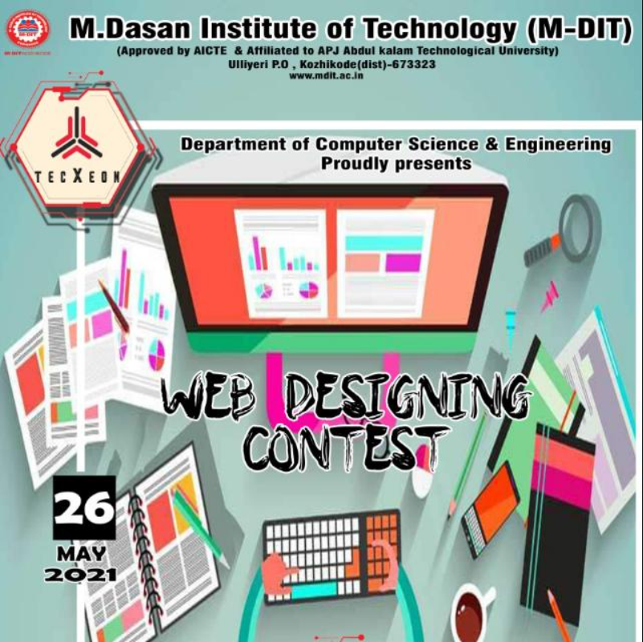

# Web Design Contest Hosted by [M-DITS](http://mdit.ac.in/)

### **TOPIC**: Website for Ethical Hacking Club of MDITS

 

 

## LIVE PREVIEW : [click here](https://akhilmuraliai.github.io/mdit-web-design-contest/)

### OVERVIEW

---

This website is compeltely responsive on all screens. Made up of materialize css. All the photos are taken from unsplash and pixabay. Get the wireframe [here](wireframe.png)

### CREDITS

---

1. [Materialize CSS](https://materializecss.com/)
2. [The Net Ninja](https://www.youtube.com/channel/UCW5YeuERMmlnqo4oq8vwUpg)
3. [Unsplash](https://unsplash.com/)
4. [Pixabay](https://pixabay.com/)
